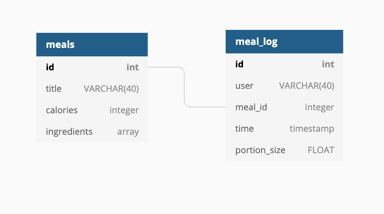

# food-diary-week-8

App live on Heroku at - https://food-diary-kas.herokuapp.com/

## Installation

To start the project in your shell 🐚 :

`npm install`

To run the project on the localhost:3000:

`npm start`

## DATABASE SCHEMA

## MVP

- App lets user add a meal type or log a meal they have eaten
- App shows user a list of meals they have logged
- App shows extra details of a specific meal the user has logged
- Build Database with schema as above
- Build queries for getting and posting data
- Build router and views
- Tests for database queries and router
- Basic styling
- Host on Heroku

## Stretch Goals 🎯

- Show the user a day by day summary (e.g. calories and food types in a day)
- User login and logout
- Travis testing

## What we learnt 📖

- Rendering dynamic information with handlebars
- Submitting values in an array from a form
- Setting up arrays and date time storage in a database table
- Building promises and testing them

## What's Gone Well 🤗

- We have tests
- We post and read data

## What Could have Gone Better 😔

- Multiple people working on queries at one time lead to merge conflict errors
- Not utilising index.js to import separate functions from files lead to merge conflict errors
- Converting everything to promises took a long time
